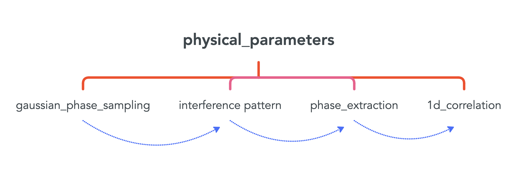

# TOF_expansion
This is a code used to simulate time-of-flight (TOF) interference pattern data acquisition and relative phase extraction of two parallel one-dimensional Bose gas experiments. In particular, this code takes into account longitudinal expansion and mixing with common degrees of freedom [1], which introduce a systematic shift to the readout phase as compared to the in situ relative phase [2]. This code requires "Statistics and Machine Learning Toolbox" and "Optimization Toolbox". 

The directory is structured as follows:  
├── classes &emsp;&emsp;       &emsp;&ensp; &emsp;&emsp; &emsp; # main classes   
├── examples &emsp; &emsp;&ensp;   &emsp;&emsp; &emsp;&ensp;             # minimal examples  
├── results  &emsp;&emsp;&nbsp;&emsp;&ensp; &emsp;&emsp;&emsp;&emsp;     # more complex use cases for generating results in the paper  
├── input     &emsp;&ensp;&emsp;&nbsp;&emsp;&ensp;&emsp;&ensp; &emsp;&ensp; &emsp;# input files needed for examples and results  
├── imaging_effect    &emsp;&ensp;&emsp;&nbsp; &emsp;# code for simulating experimental imaging system  
└── README.md  

The structure of the classes is shown in the diagram below. The red vertical lines represent inheritance and the blue lines represent simulation workflow.   

## References
[1] van Nieuwkerk, Y. D., Schmiedmayer, J., & Essler, F. (2018). Projective phase measurements in one-dimensional Bose gases. SciPost Physics, 5(5), 046. 
[2] Murtadho, T., Gluza, M., Arifa, K. Z., Erne, S., Schmiedmayer, J., & Ng, N. (2024). Systematic analysis of relative phase extraction in one-dimensional Bose gases interferometry. arXiv:2403.05528.
